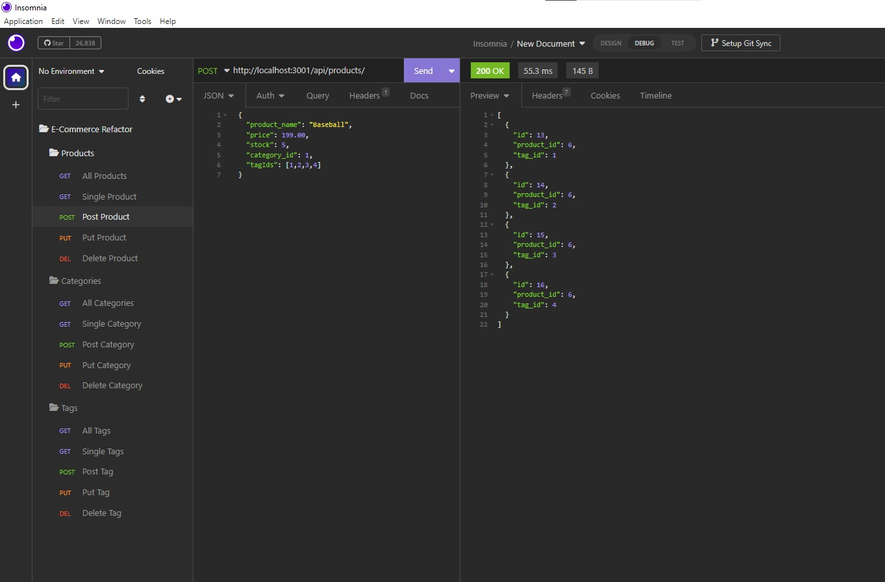

# E-Commerce Refactor by Yon B.

## Description

- Optimization of an E-commerce database. This time we worked on designing the models and routes as well as establishing the connection to the server and making sure the database was working correctly for all CRUD operations.

## Technical Skills

## Table of Contents

- [Access](#access)
- [Visuals](#visuals)
- [Credits](#credits)
- [License](#license)
- [Features](#features)
- [How to Contribute](#how-to-contribute)

## Access

## Link to the Walkthrough video [**HERE**](https://youtu.be/_9LW4YQkPLM)

## Visuals

---

---

## Credits

- Melany Pietrowski [**Melpie10**](https://github.com/Melpie10) for all your constructive 
comments and infinite patience when a concept proves difficult to understand.

-The four Codesmen- (myself being one of)
- Edwin Pietrowski [**BogartDME**](https://github.com/BogartDME)
- Denart Ifurung [**Difurung**](https://github.com/Difurung)
- Charles Beatty [**Seabass**](https://github.com/beattycharles)

## License

Copyright (c) [2023] [Yonatan Yael Bermudez Diez]

## Features

- Fully functioning CRUD operations for:

    - Products
    - Tags
    - Categories

## How to Contribute

Constructive Comments are always welcome. e-mail me: yon_baermund@hotmail.com

(<a href="#top">Back to top</a>)

